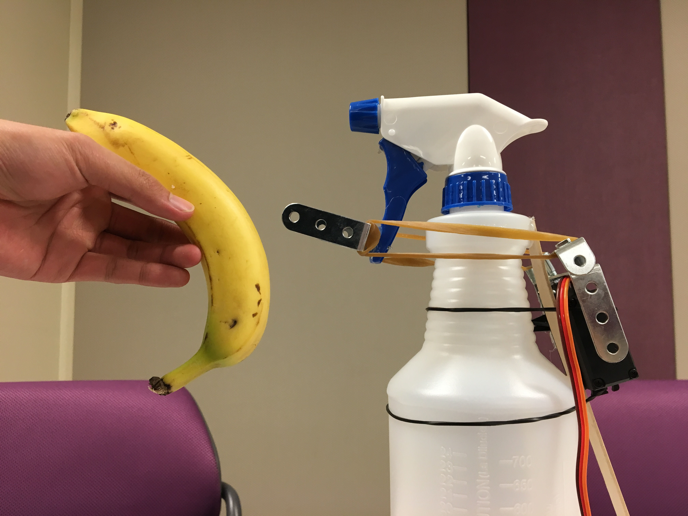

*"Get an A+ with Spray Plus."*

Watch the video [here](https://youtu.be/Pxi-8D7nLdM).

**Spray Plus** ("sprAy plus") was the [Funniest Hack winner](https://devpost.com/software/spray-plus) at HackUMass 2017. It is an IOT spray bottle with a Chrome extension that activates when you visit Youtube or Facebook.

Made by Michael Yang and Harrison Liu.
